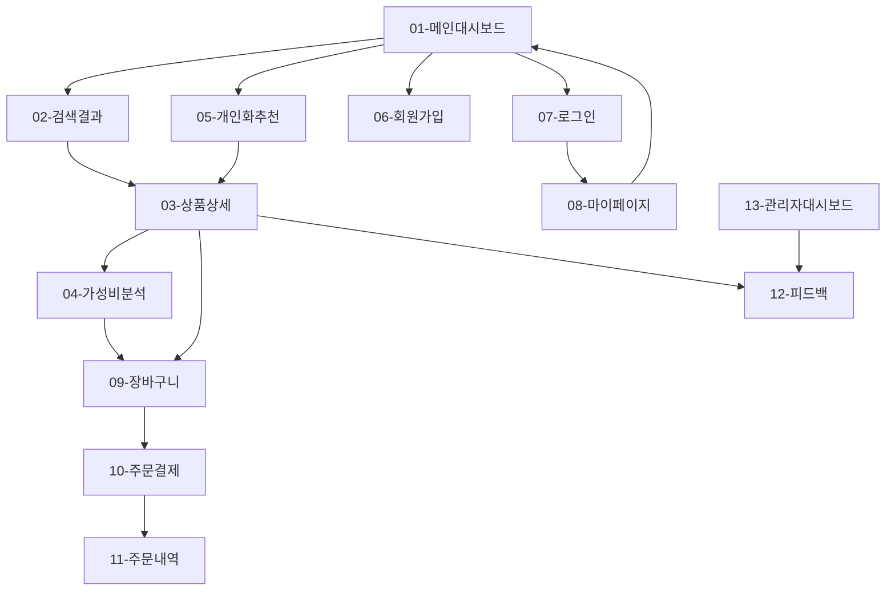

# 온라인 핸드폰 구매 사이트 - UI/UX 설계서

## 프로토타입 화면 목록

### 사용자 화면
1. **01-메인대시보드** - 검색 및 추천 진입점
2. **02-검색결과** - 상품 검색, 필터링, 목록 조회
3. **03-상품상세** - 상품 정보 및 가성비 계산 요청
4. **04-가성비분석** - 점수 상세 분석 및 이력 조회
5. **05-개인화추천** - 맞춤형 상품 추천 및 근거 제공
6. **06-회원가입** - 신규 사용자 등록
7. **07-로그인** - 사용자 인증
8. **08-마이페이지** - 개인화 설정 및 계정 관리
9. **09-장바구니** - 상품 비교 및 관리
10. **10-주문결제** - 결제 정보 입력 및 처리
11. **11-주문내역** - 주문 이력 및 배송 추적
12. **12-피드백** - 만족도 평가 및 개선 제안

### 관리자 화면
13. **13-관리자대시보드** - 피드백 분석 및 시스템 개선

---

## 화면 간 사용자 플로우

### 주요 사용자 여정

### 핵심 전환 포인트
1. **메인대시보드** → 검색/추천 (서비스 진입)
2. **상품상세** → 가성비계산 (차별화 기능 체험)
3. **가성비분석** → 장바구니 (구매 의사결정)
4. **장바구니** → 주문결제 (전환 완료)

---

## 화면별 상세 설계

### 01-메인대시보드

#### 개요
- **목적**: 서비스 첫인상 및 주요 기능 진입점 제공
- **관련 유저스토리**: 전체 서비스 진입점 역할
- **비즈니스 중요도**: M (Must) - 서비스의 얼굴

#### 주요 기능
1. **핵심 검색**: 통합 검색창 (상품명, 브랜드, 모델명)
2. **개인화 추천 진입**: "나만의 추천받기" CTA 버튼
3. **인기 상품**: 가성비 점수 기준 TOP 상품 노출
4. **서비스 소개**: 가성비 점수 계산 기능 소개

#### UI 구성요소
- **헤더**: 로고, 네비게이션, 로그인/회원가입, 장바구니
- **히어로 섹션**: 메인 검색창 + 서비스 가치 제안
- **추천 섹션**: 개인화 추천 CTA + 인기 상품 캐러셀
- **푸터**: 기업 정보, 고객센터, 이용약관

#### 인터랙션
- 검색창 포커스 시 자동완성 드롭다운
- 상품 카드 호버 시 가성비 점수 미리보기
- 추천받기 버튼 클릭 시 로그인 상태 확인 후 분기
- 반응형: 모바일에서 검색창과 CTA 버튼 최적화

---

### 02-검색결과

#### 개요
- **목적**: 상품 검색, 필터링, 비교를 통한 상품 발견
- **관련 유저스토리**: UFR-PROD-010, 020, 030
- **비즈니스 중요도**: M (Must) - 핵심 쇼핑 경험

#### 주요 기능
1. **검색 결과 표시**: 키워드 매칭 상품 목록
2. **다중 필터링**: 가격, 브랜드, 성능 조건 설정
3. **정렬 옵션**: 가성비 점수, 인기도, 가격순
4. **재고 상태**: 실시간 재고 확인 및 표시

#### UI 구성요소
- **검색바**: 키워드 + 검색 옵션
- **필터 패널**: 좌측 고정 (데스크톱) / 모달 (모바일)
  - 가격 범위 슬라이더
  - 브랜드 다중 선택 체크박스
  - 성능 필터 (RAM, 저장용량, 화면크기, 배터리)
- **결과 영역**: 상품 카드 그리드 (3열→2열→1열)
- **상품 카드**: 이미지, 상품명, 가격, 가성비 점수 미리보기, 재고 상태

#### 인터랙션
- **필터 적용**: 실시간 결과 업데이트 (AJAX)
- **필터 태그**: 적용된 조건 시각적 표시 및 개별 제거
- **무한 스크롤**: 추가 상품 자동 로드
- **상품 카드 클릭**: 상품상세 페이지 이동
- **가성비 점수 호버**: 간단한 점수 설명 툴팁

---

### 03-상품상세

#### 개요
- **목적**: 상품 정보 제공 및 가성비 계산을 통한 구매 의사결정 지원
- **관련 유저스토리**: UFR-PROD-040, UFR-SCOR-010, 020
- **비즈니스 중요도**: M (Must) - 핵심 전환 화면

#### 주요 기능
1. **상품 정보**: 이미지 갤러리, 상세 사양, 가격 정보
2. **가성비 계산**: 실시간 점수 계산 및 표시
3. **리뷰 시스템**: 사용자 리뷰 및 평점
4. **구매 액션**: 장바구니 담기, 바로구매

#### UI 구성요소
- **상품 갤러리**: 메인 이미지 + 썸네일 (줌 기능)
- **상품 정보 패널**:
  - 기본 정보 (상품명, 가격, 할인 정보)
  - **가성비 점수 섹션** (대형 점수 표시 + 계산 버튼)
  - 상세 사양 (아코디언 형태)
- **액션 버튼**: 가성비 계산, 장바구니 담기, 바로구매
- **리뷰 섹션**: 평점 요약 + 최신 리뷰 3개
- **관련 상품**: 유사 제품 추천 캐러셀

#### 인터랙션
- **가성비 계산 버튼**: 클릭 시 로딩 상태 → 5초 내 점수 표시
- **점수 표시**: 0-100 점수 + 등급 (우수/양호/보통/개선필요)
- **상세 분석 버튼**: 04-가성비분석 페이지 이동
- **이미지 갤러리**: 스와이프, 확대/축소 지원
- **탭 네비게이션**: 상세정보, 리뷰, 관련상품 간 전환

---

### 04-가성비분석

#### 개요
- **목적**: 가성비 점수의 투명한 분석 및 근거 제공으로 신뢰성 구축
- **관련 유저스토리**: UFR-SCOR-030, 040
- **비즈니스 중요도**: S (Should) - 차별화 요소 강화

#### 주요 기능
1. **점수 분해도**: 가격, 성능, 리뷰 비율 시각화
2. **계산 근거**: 사용된 데이터 및 공식 설명
3. **경쟁사 비교**: 유사 제품 대비 위치
4. **점수 이력**: 30일간 변화 추이 그래프

#### UI 구성요소
- **점수 대시보드**: 총점 + 세부 점수 (원형 차트)
- **분해 차트**: 가격:성능:리뷰 비율 (파이 차트)
- **비교 테이블**: 경쟁 제품 3개와의 스코어 비교
- **이력 그래프**: 30일 점수 변화 (라인 차트)
- **데이터 출처**: 사용된 API 및 데이터 소스 명시

#### 인터랙션
- **차트 인터랙션**: 호버 시 상세 수치 표시
- **기간 선택**: 7일/30일 점수 이력 전환
- **비교 제품 선택**: 다른 경쟁사 제품으로 교체
- **상세 설명 토글**: 계산 방식 자세히 보기/숨기기

---

### 05-개인화추천

#### 개요
- **목적**: 사용자 선호도 기반 맞춤형 상품 추천으로 개인화 쇼핑 경험 제공
- **관련 유저스토리**: UFR-RECO-010, 020, 030
- **비즈니스 중요도**: S (Should) - 사용자 만족도 향상

#### 주요 기능
1. **추천 설정**: 예산, 브랜드, 용도 선택
2. **추천 결과**: 개인화된 상위 5개 상품
3. **추천 근거**: 왜 이 상품이 추천되는지 설명
4. **고득점 필터**: 70점 이상 고품질 상품만 선별

#### UI 구성요소
- **설정 패널**:
  - 예산 범위 슬라이더
  - 선호 브랜드 체크박스
  - 용도 선택 (게임, 사진, 업무, 일반)
- **추천 결과 카드**:
  - 추천 순위 + 개인화 점수
  - 추천 이유 요약
  - "자세한 이유 보기" 버튼
- **필터 옵션**: 고득점만 보기 토글

#### 인터랙션
- **설정 변경**: 실시간 추천 결과 업데이트
- **추천 이유 모달**: 상세 근거 팝업
- **개인화 점수 표시**: 일반 가성비 점수와 구분
- **상품 카드 액션**: 상세보기, 장바구니, 유사상품

---

### 06-회원가입

#### 개요
- **목적**: 신규 사용자의 간편한 서비스 가입 및 개인화 기능 이용 유도
- **관련 유저스토리**: UFR-USER-010
- **비즈니스 중요도**: M (Must) - 사용자 확보

#### 주요 기능
1. **기본 정보 입력**: 이메일, 비밀번호, 닉네임
2. **이메일 인증**: 인증 코드 발송 및 확인
3. **약관 동의**: 필수/선택 약관 구분
4. **소셜 가입**: 구글, 카카오, 네이버 연동

#### UI 구성요소
- **가입 폼**: 단계별 프로그레스 바 (3단계)
- **입력 필드**: 실시간 유효성 검사 및 피드백
- **소셜 가입 버튼**: 브랜드 컬러 적용
- **약관 섹션**: 펼침/접기 가능한 전문 표시

#### 인터랙션
- **실시간 검증**: 이메일 중복, 비밀번호 강도 체크
- **단계별 진행**: 이전/다음 버튼으로 단계 이동
- **자동 포커스**: 다음 입력 필드로 자동 이동
- **가입 완료**: 환영 메시지 후 메인 페이지 리다이렉트

---

### 07-로그인

#### 개요
- **목적**: 기존 사용자의 편리한 서비스 접근 및 개인화 기능 활성화
- **관련 유저스토리**: UFR-USER-020
- **비즈니스 중요도**: M (Must) - 사용자 재방문

#### 주요 기능
1. **일반 로그인**: 이메일/비밀번호 인증
2. **소셜 로그인**: 간편 인증 옵션
3. **로그인 유지**: 자동 로그인 설정
4. **비밀번호 찾기**: 이메일을 통한 재설정

#### UI 구성요소
- **로그인 폼**: 미니멀한 2단 입력 필드
- **로그인 옵션**: 자동 로그인, 아이디 저장 체크박스
- **소셜 로그인**: 아이콘 버튼 배치
- **도움말 링크**: 비밀번호 찾기, 회원가입

#### 인터랙션
- **로그인 처리**: 로딩 스피너 → 성공/실패 피드백
- **보안 처리**: 5회 실패 시 계정 임시 잠금
- **리다이렉션**: 이전 페이지 또는 메인으로 이동
- **소셜 로그인**: 팝업 창을 통한 OAuth 처리

---

### 08-마이페이지

#### 개요
- **목적**: 개인 정보 관리 및 가성비 계산 기준 개인화 설정
- **관련 유저스토리**: UFR-USER-030, UFR-ORDE-040
- **비즈니스 중요도**: S (Should) - 사용자 재방문 및 개인화

#### 주요 기능
1. **개인화 설정**: 가격/성능/리뷰 가중치 조정
2. **계정 관리**: 프로필 정보 수정
3. **주문 내역**: 구매 이력 및 배송 추적
4. **설정 이력**: 가중치 변경 기록

#### UI 구성요소
- **사이드 네비게이션**: 설정 메뉴 구분
- **개인화 설정 패널**:
  - 가중치 슬라이더 (총 100% 제한)
  - 실시간 미리보기 차트
- **주문 내역 테이블**: 날짜, 상품, 상태, 액션
- **프로필 설정**: 개인 정보 수정 폼

#### 인터랙션
- **가중치 조정**: 드래그로 비율 변경, 실시간 반영
- **미리보기**: 설정 변경 시 샘플 점수 변화 표시
- **설정 저장**: 변경사항 자동 저장 및 확인 메시지
- **주문 추적**: 배송 상태 클릭 시 상세 추적 정보

---

### 09-장바구니

#### 개요
- **목적**: 관심 상품 관리 및 구매 전 최종 비교 검토
- **관련 유저스토리**: UFR-ORDE-010, 020
- **비즈니스 중요도**: M (Must) - 구매 전환 핵심

#### 주요 기능
1. **상품 관리**: 수량 변경, 삭제, 저장
2. **가성비 비교**: 장바구니 내 상품간 점수 비교
3. **총액 계산**: 실시간 주문 금액 업데이트
4. **구매 프로세스**: 선택 상품 주문 진행

#### UI 구성요소
- **상품 목록**: 테이블 형태의 상품 정보
  - 상품 이미지, 이름, 가격
  - 가성비 점수 표시
  - 수량 조절 버튼
  - 삭제 체크박스
- **비교 섹션**: 가성비 점수 막대 그래프
- **주문 요약**: 총 상품금액, 배송비, 최종 결제금액
- **액션 버튼**: 선택삭제, 전체삭제, 주문하기

#### 인터랙션
- **수량 변경**: +/- 버튼으로 즉시 반영
- **일괄 선택**: 체크박스로 다중 선택/해제
- **비교 모드**: 2개 이상 선택 시 비교 패널 활성화
- **주문 진행**: 선택된 상품만 주문 페이지 이동

---

### 10-주문결제

#### 개요
- **목적**: 안전하고 편리한 결제 프로세스를 통한 구매 완료
- **관련 유저스토리**: UFR-ORDE-030
- **비즈니스 중요도**: M (Must) - 매출 실현

#### 주요 기능
1. **배송지 관리**: 새 주소 입력 또는 기존 주소 선택
2. **결제 수단**: 카드, 계좌이체, 간편결제 옵션
3. **주문 확인**: 상품, 금액, 배송 정보 최종 검토
4. **보안 결제**: PG사 연동 안전 결제

#### UI 구성요소
- **단계 표시**: 장바구니 → 주문정보 → 결제 → 완료
- **배송지 섹션**:
  - 기존 주소록 선택 라디오 버튼
  - 새 주소 입력 폼 (접기/펼치기)
- **결제 수단 선택**: 탭 형태의 결제 옵션
- **주문 요약**: 우측 고정 패널로 주문 내역 표시
- **결제 버튼**: 최종 결제금액과 함께 CTA 버튼

#### 인터랙션
- **주소 관리**: 기존/신규 주소 토글로 입력 폼 전환
- **결제 수단**: 선택에 따른 입력 폼 변경
- **실시간 검증**: 배송지, 결제 정보 유효성 체크
- **보안 결제**: PG 팝업 또는 iframe 연동

---

### 11-주문내역

#### 개요
- **목적**: 주문 이력 관리 및 배송 추적을 통한 고객 만족도 제고
- **관련 유저스토리**: UFR-ORDE-040
- **비즈니스 중요도**: M (Must) - 고객 서비스

#### 주요 기능
1. **주문 목록**: 날짜별 주문 이력 표시
2. **배송 추적**: 실시간 배송 상태 업데이트
3. **주문 관리**: 취소, 교환, 반품 신청
4. **리뷰 작성**: 배송 완료 후 상품평 등록

#### UI 구성요소
- **필터 탭**: 전체, 주문완료, 배송중, 배송완료
- **주문 카드**:
  - 주문번호, 날짜, 상태
  - 상품 이미지 및 정보
  - 배송 추적 버튼
- **상세 모달**: 주문 상세 정보 팝업
- **액션 버튼**: 상황별 가능한 액션 표시

#### 인터랙션
- **상태별 필터**: 탭 클릭으로 주문 상태 필터링
- **배송 추적**: 클릭 시 상세 배송 정보 모달
- **주문 액션**: 상태에 따른 취소/교환/반품/리뷰 버튼
- **페이지네이션**: 오래된 주문 내역 로드

---

### 12-피드백

#### 개요
- **목적**: 사용자 만족도 수집 및 서비스 개선 의견 청취
- **관련 유저스토리**: UFR-FEED-010, 020
- **비즈니스 중요도**: C (Could) - 서비스 개선

#### 주요 기능
1. **만족도 평가**: 5점 척도 다차원 평가
2. **개선 제안**: 자유 의견 및 카테고리 선택
3. **익명 피드백**: 개인정보 보호 옵션
4. **피드백 보상**: 참여 혜택 제공

#### UI 구성요소
- **평가 섹션**:
  - 점수 정확성, 추천 품질, 전반 만족도
  - 별점 또는 슬라이더 입력
- **의견 입력**: 카테고리 선택 + 자유 텍스트 (500자)
- **옵션 선택**: 익명 제출, 답변 알림 설정
- **제출 버튼**: 피드백 완료 및 포인트 적립 안내

#### 인터랙션
- **별점 입력**: 클릭 또는 드래그로 점수 선택
- **카테고리 선택**: 드롭다운으로 개선 분야 선택
- **글자 수 제한**: 실시간 글자 수 표시
- **제출 완료**: 감사 메시지 및 다음 피드백 요청일 안내

---

### 13-관리자대시보드

#### 개요
- **목적**: 피드백 분석 및 시스템 개선을 위한 관리도구 제공
- **관련 유저스토리**: AFR-FEED-010, 020
- **비즈니스 중요도**: S (Should) - 운영 효율성

#### 주요 기능
1. **피드백 분석**: 만족도 추이 및 키워드 분석
2. **알고리즘 관리**: 가성비 가중치 조정
3. **A/B 테스트**: 개선안 테스트 및 결과 분석
4. **시스템 모니터링**: 성능 지표 및 오류 추적

#### UI 구성요소
- **대시보드 그리드**: 4개 주요 위젯 배치
  - 만족도 트렌드 차트
  - 피드백 키워드 클라우드
  - 가성비 점수 분포
  - 시스템 성능 지표
- **관리 메뉴**: 사이드바 네비게이션
- **설정 패널**: 알고리즘 파라미터 조정
- **테스트 관리**: A/B 테스트 생성 및 모니터링

#### 인터랙션
- **기간 선택**: 대시보드 데이터 기간 필터
- **드릴다운**: 차트 클릭으로 상세 데이터 조회
- **알고리즘 조정**: 슬라이더로 가중치 실시간 변경
- **테스트 관리**: 실험 생성, 실행, 결과 분석

---

## 화면간 전환 및 네비게이션

### 글로벌 네비게이션
- **헤더**: 로고, 검색창, 로그인/마이페이지, 장바구니
- **푸터**: 고객센터, 이용약관, 개인정보처리방침
- **브레드크럼**: 현재 페이지 위치 표시 (상품상세, 가성비분석)

### 페이지 간 이동 패턴
1. **순차적 이동**: 검색 → 상품상세 → 가성비분석 → 장바구니 → 주문
2. **허브 중심**: 메인대시보드를 통한 주요 기능 접근
3. **컨텍스트 유지**: 이전 페이지 정보 보존 (검색 조건, 필터 등)
4. **빠른 액션**: 모든 페이지에서 장바구니 담기, 로그인 접근

### 모바일 네비게이션
- **햄버거 메뉴**: 주요 메뉴 접근
- **하단 탭바**: 홈, 검색, 마이페이지, 장바구니
- **플로팅 버튼**: 검색, 장바구니 등 핵심 액션

---

## 반응형 설계 전략

### 브레이크포인트
- **Mobile**: 320px - 767px (1열 레이아웃)
- **Tablet**: 768px - 1023px (2열 레이아웃)
- **Desktop**: 1024px 이상 (3열 레이아웃)

### 주요 적응 전략
1. **콘텐츠 우선순위**: 모바일에서 핵심 정보 우선 표시
2. **터치 최적화**: 버튼 크기 44px 이상, 충분한 여백
3. **로딩 최적화**: 이미지 지연로딩, 중요 콘텐츠 우선
4. **네비게이션**: 모바일 햄버거 메뉴, 태블릿 탭 메뉴

### 주요 컴포넌트 적응
- **상품 카드**: 3열 → 2열 → 1열 그리드 변화
- **필터 패널**: 사이드바 → 모달 → 풀스크린
- **가성비 점수**: 크기 조정 및 위치 최적화
- **폼 입력**: 세로 배치, 큰 입력 필드

---

## 접근성 보장 방안

### WCAG 2.1 AA 준수
1. **인식의 용이성**
   - 이미지 대체텍스트 제공
   - 색상만으로 정보 전달 금지 (가성비 점수 등급)
   - 충분한 명도 대비 (4.5:1 이상)

2. **운용의 용이성**
   - 키보드만으로 모든 기능 접근
   - 포커스 표시 명확화
   - 자동재생 콘텐츠 제어 가능

3. **이해의 용이성**
   - 명확한 페이지 제목 및 헤딩 구조
   - 폼 라벨 및 오류 메시지 제공
   - 일관성 있는 네비게이션

4. **견고성**
   - 스크린 리더 호환성
   - HTML 표준 준수
   - 크로스 브라우저 호환성

### 특화 접근성
- **가성비 점수**: 숫자와 텍스트 병행 표시
- **차트**: 대체 데이터 테이블 제공
- **필터**: 스크린 리더 친화적 폼 구조

---

## 성능 최적화 방안

### 로딩 성능
1. **Critical Path 최적화**
   - 중요 CSS 인라인 처리
   - 폰트 최적화 (woff2, font-display: swap)
   - 이미지 지연 로딩 (Intersection Observer)

2. **번들 최적화**
   - 코드 스플리팅 (페이지별 청크)
   - 트리 쉐이킹으로 불필요 코드 제거
   - 웹팩 최적화 설정

3. **캐싱 전략**
   - 브라우저 캐시 (정적 자산)
   - API 응답 캐시 (Redis)
   - CDN 활용 (이미지, CSS/JS)

### 런타임 성능
1. **리액트 최적화**
   - React.memo로 불필요한 리렌더링 방지
   - useMemo/useCallback 적절한 활용
   - 가상화 (react-window) 대량 데이터 처리

2. **API 최적화**
   - GraphQL 또는 필드 선택 API
   - 페이지네이션 및 무한 스크롤
   - 병렬 API 호출 최적화

3. **UX 성능**
   - 스켈레톤 로딩
   - 옵티미스틱 업데이트
   - 백그라운드 데이터 프리페치

### 핵심 성능 목표
- **First Contentful Paint**: 1.5초 이내
- **Largest Contentful Paint**: 2.5초 이내
- **Time to Interactive**: 3초 이내
- **가성비 계산 응답**: 5초 이내

---

## 변경 이력

### v1.0 (2024-XX-XX)
- 초기 UI/UX 설계 완료
- 12개 사용자 화면 + 1개 관리자 화면 설계
- 가성비 점수 중심 UX 전략 수립
- 반응형 설계 및 접근성 방안 정의
- 성능 최적화 전략 수립